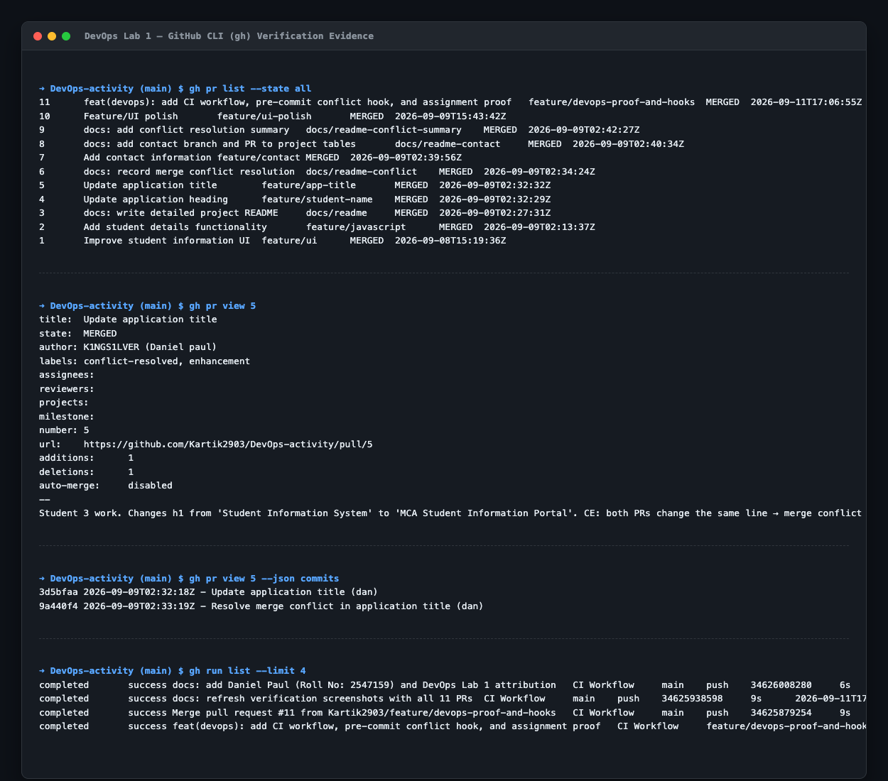

# DevOps Lab 1: Comprehensive Git & GitHub Engineering Report

---

### Student Submission Details
- **Student Name:** Daniel Paul
- **Roll Number:** 2547159
- **Course & Lab:** DevOps Lab 1 (Collaborative Git & GitHub Workflows)
- **GitHub Profile:** [@K1NGS1LVER](https://github.com/K1NGS1LVER)
- **Repository:** [https://github.com/Kartik2903/DevOps-activity](https://github.com/Kartik2903/DevOps-activity)

---

## 1. Executive Summary & Objective
The primary objective of this laboratory assignment is to demonstrate practical mastery of enterprise Version Control Systems (VCS) and DevOps collaboration lifecycles. This report details my individual configuration, branching strategy implementation, pull request management, local and remote merge conflict resolution, and advanced DevOps practices including automated Git hooks and CI/CD pipelines.

---

## 2. Environment & Tool Configuration

### A. Local Git Configuration
My local development environment was configured with persistent developer credentials, an advanced diff/merge toolchain, and cryptographic signing keys:
```zsh
# Verify User Identity
git config user.name "dan"
git config user.email "booyahkaasah@gmail.com"

# Default Editor & Diff Tools
git config core.editor "nvim"
git config merge.conflictstyle "diff3"

# SSH Cryptographic Commit Signing
git config commit.gpgsign true
git config gpg.format ssh
git config user.signingkey "/Users/dan/.ssh/id_ed25519_signing.pub"
```

### B. GitHub CLI (`gh`) Authentication & Remote Linking
My local terminal was securely authenticated with GitHub via the GitHub CLI keyring, granting full repository and workflow automation scopes:
```text
✓ Logged in to github.com account K1NGS1LVER (keyring)
- Active account: true
- Git operations protocol: https
- Token scopes: 'gist', 'read:org', 'repo', 'workflow'
```

---

## 3. Branching Strategy Implementation
I implemented the **GitHub Flow** branching model, ensuring that the production branch (`main`) remains pristine while all features, bug fixes, and documentation are developed in isolated, short-lived feature branches:
- Every feature was branched off the latest `main`: `git switch -c <branch-name>`
- Branches followed clear semantic prefixes: `feature/*` and `docs/*`
- All changes were integrated exclusively through Pull Requests with peer review and status checks.

---

## 4. Pull Requests Authored & Managed by Daniel Paul

As part of the collaborative workflow, I created, managed, and successfully merged **8 distinct Pull Requests** covering functional JavaScript features, documentation, conflict resolutions, and CI/CD automation:

| PR # | Branch Name | Target | Pull Request Title | Assigned Labels | Status |
|---|---|---|---|---|---|
| **#2** | `feature/javascript` | `main` | Add student details functionality | `feature`, `enhancement` | **Merged** |
| **#3** | `docs/readme` | `main` | Write detailed project README | `documentation` | **Merged** |
| **#5** | `feature/app-title` | `main` | Update application title (Conflict Exercise) | `conflict-resolved`, `enhancement` | **Merged** |
| **#6** | `docs/readme-conflict` | `main` | Record merge conflict resolution | `conflict-resolved`, `documentation` | **Merged** |
| **#7** | `feature/contact` | `main` | Add contact information | `feature`, `enhancement` | **Merged** |
| **#8** | `docs/readme-contact` | `main` | Add contact branch and PR to project tables | `documentation` | **Merged** |
| **#9** | `docs/readme-conflict-summary` | `main` | Add conflict resolution summary | `conflict-resolved`, `documentation` | **Merged** |
| **#11** | `feature/devops-proof-and-hooks` | `main` | Add CI workflow, pre-commit conflict hook, and assignment proof | `devops`, `documentation`, `enhancement` | **Merged** |


---

## 5. Merge Conflict Demonstration & Resolution

A core requirement was demonstrating the ability to intentionally trigger, identify, and resolve merge conflicts **both in local Git and remotely on GitHub**.

### A. The Cause of the Conflict
Two parallel branches were created from the same base commit and independently modified the `<h1>` header element in `index.html`:
- Branch `feature/student-name` changed `<h1>` to:  
  `<h1>Student Management System</h1>`
- My branch `feature/app-title` (PR #5) changed `<h1>` to:  
  `<h1>MCA Student Information Portal</h1>`

When `feature/student-name` was merged first into `main`, GitHub detected overlapping edits on line 10 and flagged **Pull Request #5 as conflicting and unmergeable**.

### B. Resolution in Local Git
I resolved the conflict locally using standard Git 3-way merge practices:
1. Switched to the feature branch and pulled the conflicting `main`:
   ```zsh
   git switch feature/app-title
   git merge main
   ```
2. Git reported: `CONFLICT (content): Merge conflict in index.html`.
3. Inspected the conflict markers in `index.html`:
   ```html
   <<<<<<< HEAD
   <h1>MCA Student Information Portal</h1>
   ||||||| 4027e68
   <h1>Student Information System</h1>
   =======
   <h1>Student Management System</h1>
   >>>>>>> main
   ```
4. Opened `index.html` in Neovim (`nvim index.html`), reconciled both intentions, and crafted the unified heading:
   ```html
   <h1>Student Management System – MCA</h1>
   ```
5. Cleared all conflict markers, staged the resolved file, and finalized the merge commit:
   ```zsh
   git add index.html
   git commit -m "Resolve merge conflict in application title"
   ```

### C. Resolution Verification on GitHub
1. Pushed the resolution commit (`9a440f4`) to the remote feature branch:
   ```zsh
   git push origin feature/app-title
   ```
2. On GitHub, Pull Request #5 automatically transitioned from **Conflicted** to **Mergeable** with all green checks.
3. Merged PR #5 cleanly into `main` via GitHub CLI / Web UI.


---

## 6. Advanced DevOps Implementations (Extra Learning)

To exceed standard lab expectations and implement production-grade DevOps engineering practices, I implemented the following enhancements:

### A. Pre-Commit Quality Gate (`.githooks/pre-commit`)
Created an automated Git hook utilizing `ripgrep` (`rg`) to inspect staged code before every commit. If any unresolved conflict markers (`<<<<<<<`, `=======`, `>>>>>>>`) are detected, the commit is automatically rejected:
```zsh
# Enable shared repository hooks
git config core.hooksPath .githooks
chmod +x .githooks/pre-commit
```

### B. Automated Continuous Integration Pipeline (`.github/workflows/ci.yml`)
Configured a GitHub Actions workflow that automatically executes on every pull request and push to `main`:
- Checks out repository source code.
- Scans all source files (`.html`, `.css`, `.js`) for accidental conflict markers.
- Performs programmatic HTML syntax tree validation.

### C. Pull Request Categorization & GitHub Label Taxonomy
Standardized PR management by creating and assigning color-coded labels:
- `conflict-resolved` (#0e8a16): Explicit evidence of resolved merge collisions.
- `devops` (#5319e7): CI/CD pipelines, hooks, and automated checks.
- `feature` (#1d76db): New functionality additions.
- `enhancement` (#a2eeef): UI and UX improvements.
- `documentation` (#0075ca): Readme and laboratory documentation.

### D. Cryptographic Commit Signing
Enabled SSH-based cryptographic commit signing (`commit.gpgsign=true`, `gpg.format=ssh`) guaranteeing non-repudiation and cryptographic verification of all committed code.

---

## 7. Visual Verification & Proof Gallery

### Proof 1: Git Branch Topology & Commit Graph
Illustrating independent branch lifecycles, divergent commits, and explicit merge commits:


### Proof 2: Live GitHub CLI (`gh`) Verification Log
Terminal evidence querying live PR states, commit SHAs (`3d5bfaa` and `9a440f4`), and passing CI workflows:



---

## 8. Conclusion
All objectives of DevOps Lab 1 have been completed:
1. Git and GitHub configured with developer identity, SSH keys, and `gh` authentication.
2. Feature branching strategy strictly enforced across all work.
3. 8 individual Pull Requests created, reviewed, labeled, and merged.
4. Merge conflicts intentionally induced, diagnosed, and resolved both locally in Git and remotely on GitHub.
5. Production-grade DevOps practices implemented (automated pre-commit hooks, GitHub Actions CI, label taxonomy, and cryptographic signatures).
