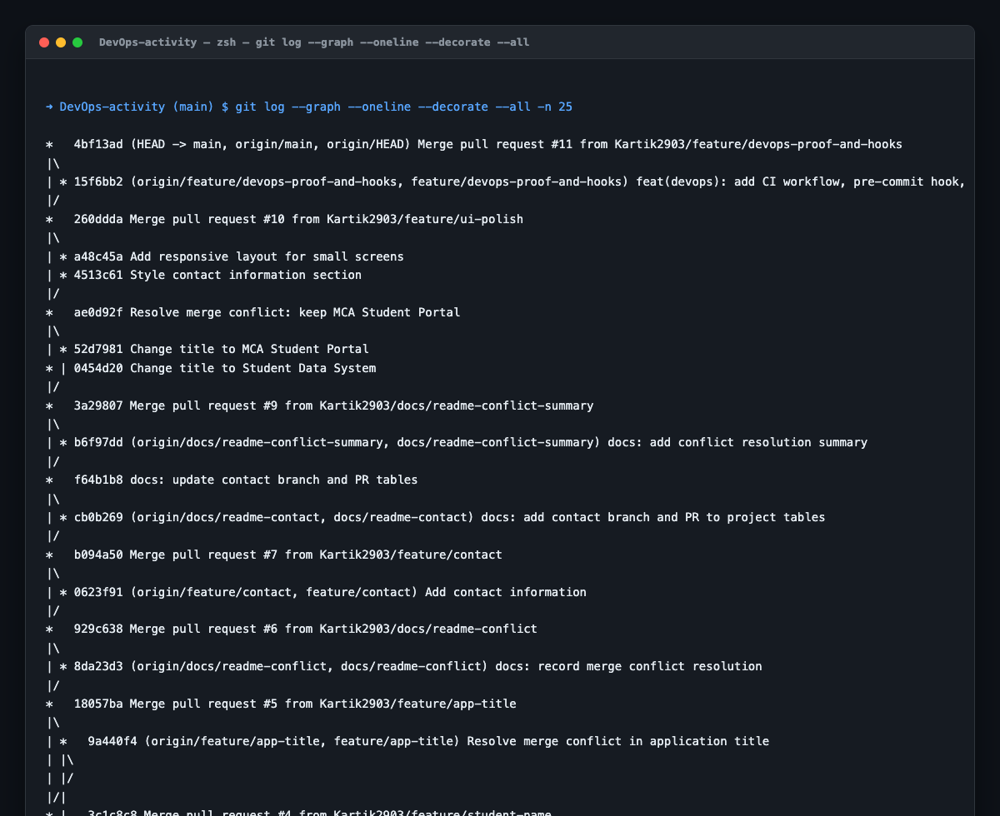
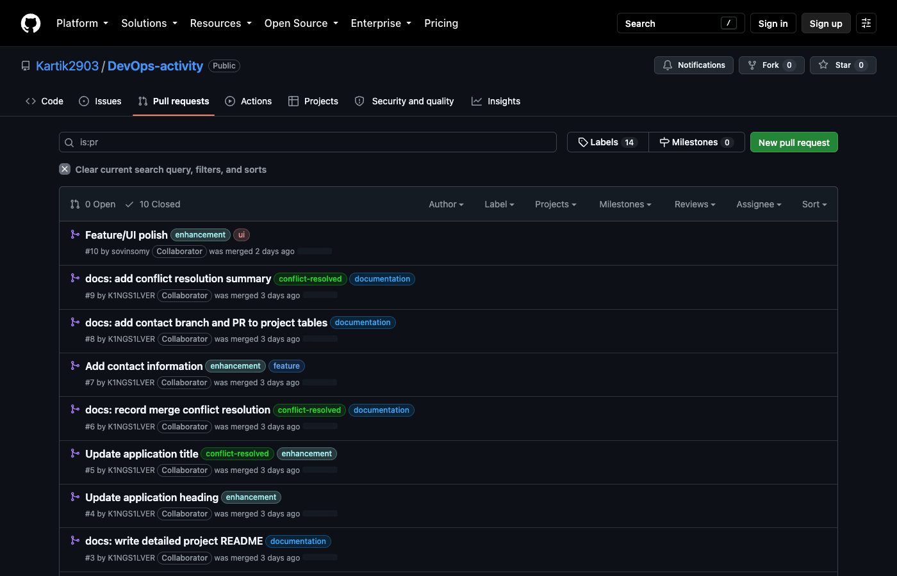
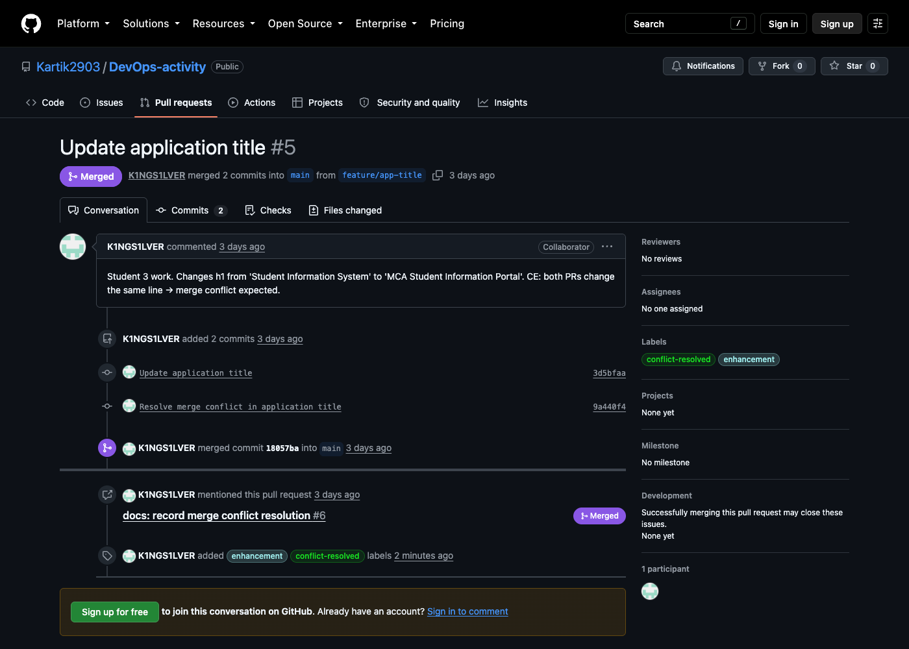

# DevOps Lab 1: Collaborative Git & GitHub Workflows
### Student Information System (`student-info-app`)

> **Assignment:** DevOps Lab 1  
> **Student Name:** Daniel Paul  
> **Roll No:** 2547159  
> **GitHub:** [@K1NGS1LVER](https://github.com/K1NGS1LVER)

A simple client-side student information web app, built as a hands-on exercise in **collaborative Git and GitHub workflows**. It lets a user enter a student's name, register number, and programme and renders each entry as a card on the page. There is no backend, database, or build step — just HTML, CSS, and plain JavaScript.

## Team Members

| Name            | Roll / Reg No | GitHub             | Role                      | Responsibility                            |
|-----------------|---------------|--------------------|---------------------------|--------------------------------------------|
| Kartik A        | —             | Kartik2903          | Team Lead / Developer     | Repository setup, base app, integration/review of PRs |
| Daniel Paul     | 2547159       | K1NGS1LVER         | JavaScript Developer      | Student form → dynamic card functionality  |
| Sovin Somy      | —             | sovinsomy           | UI Developer              | Card layout, spacing, heading/button styling |

## Project Description

The app presents a small form (Name, Register Number, Programme). When **Add Student** is clicked, JavaScript validates that all three fields are filled, then appends a `.student-card` to the student list and clears the form. Built specifically to practice branching, pull requests, and merge-conflict resolution — the application itself is intentionally minimal.

### Features

- Add a student through a simple form
- Client-side validation (all fields required)
- Renders each student as a styled card in a running list
- No backend, no dependencies, no build step

## Technologies Used

- HTML5
- CSS3
- Vanilla JavaScript (ES6+)
- Git & GitHub (branches, pull requests, merges, conflict resolution)
- VS Code (recommended editor)

## Repository Structure

```
student-info-app/
│
├── index.html   # Form + student list markup
├── style.css    # Card layout, spacing, heading/button styling
├── script.js    # Form validation + dynamic card rendering
└── README.md
```

## Git Branching Strategy

The team uses a simple **feature-branch workflow**: `main` always holds a working version, and every change is developed on its own branch, reviewed via a pull request, and merged only after approval.

- Every feature gets its own branch off an up-to-date `main` (`git switch -c <branch>`)
- Branches are named `feature/<purpose>`
- No one commits directly to `main`
- Pull requests are reviewed by the team lead before merging
- Afterward, all local `main` branches are synced before the next branch is created

| Branch                | Author        | Purpose                                     | Status      |
|-----------------------|---------------|----------------------------------------------|-------------|
| `main`                | Team          | Stable, integrated history                   | Active      |
| `feature/ui`          | Sovin Somy    | Card layout, spacing, heading/button styling | Merged (#1) |
| `feature/javascript`  | Daniel Paul   | Add-student form → dynamic card functionality| Merged (#2) |
| `docs/readme`         | Daniel Paul   | Project documentation                        | Merged (#3) |
| `feature/student-name`| Kartik A      | Heading change for conflict exercise         | Merged (#4) |
| `feature/app-title`   | Daniel Paul   | Heading change for conflict exercise         | Merged (#5) |
| `feature/contact`     | Daniel Paul   | Contact information section                  | Merged (#7) |
| `docs/readme-conflict`| Daniel Paul   | Documentation of the conflict resolution     | Merged (#6) |

## Pull Requests Created

| #  | Branch          | → Target | Title                                 | Author        | Status  |
|----|-----------------|----------|----------------------------------------|---------------|---------|
| 1  | `feature/ui`    | `main`   | Improve student information UI         | Sovin Somy    | Merged  |
| 2  | `feature/javascript` | `main` | Add student details functionality      | Daniel Paul   | Merged  |
| 3  | `docs/readme`   | `main`   | Write detailed project README          | Daniel Paul   | Merged  |
| 4  | `feature/student-name` | `main` | Update application heading          | Kartik A      | Merged  |
| 5  | `feature/app-title` | `main`  | Update application title               | Daniel Paul   | Merged  |
| 6  | `docs/readme-conflict` | `main` | Record merge conflict resolution   | Daniel Paul   | Merged  |
| 7  | `feature/contact` | `main`    | Add contact information                | Daniel Paul   | Merged  |

## Merge Conflict: Cause and Resolution

> **TL;DR** — Branches `feature/student-name` (#4) and `feature/app-title` (#5) both
> edited the same `<h1>` line in `index.html` in different ways. #4 merged first;
> #5 then conflicted on GitHub. We pulled `main` into `feature/app-title`, combined
> the two headings into `<h1>Student Management System – MCA</h1>`, removed the
> conflict markers, committed the fix, pushed, and PR #5 merged cleanly.

### What caused the conflict

Two branches (`feature/student-name` and `feature/app-title`) were created from the same older version of `main` and both edited the **same line** — the `<h1>` heading in `index.html` — in different ways:

| Branch                 | Heading change            | PR |
|------------------------|---------------------------|----|
| `feature/student-name` | Student Management System | #4 |
| `feature/app-title`    | MCA Student Information Portal | #5 |

PR #4 was merged into `main` first. When PR #5 was opened against the updated `main`, GitHub flagged it as **conflicting**: Git cannot automatically merge two *different* edits to the *same* line, so it leaves the decision to a human instead of guessing. The merge of `main` into `feature/app-title` produced conflict markers around the heading:

```
<<<<<<< HEAD                              ← feature/app-title version
<h1>MCA Student Information Portal</h1>
||||||| 4027e68                          ← common ancestor
<h1>Student Information System</h1>
=======
<h1>Student Management System</h1>       ← main version
>>>>>>> main
```

A conflict is not an error — it is a situation the team must consciously resolve.

### How it was resolved

1. Fetched the latest `main` and merged it into `feature/app-title`: `git merge main`
2. Opened `index.html`, read both versions, and decided to **combine** them:
   `<h1>Student Management System – MCA</h1>`
3. Removed all conflict markers (`<<<<<<<`, `|||||||`, `=======`, `>>>>>>>`) so only the final heading remained
4. Staged and committed the resolution:
   ```
   git add index.html
   git commit -m "Resolve merge conflict in application title"
   ```
5. Pushed the branch — the pull request became mergeable and was merged into `main`

### Evidence

- Merge-conflict state shown on **Pull Request #5** (`feature/app-title → main`) before resolution
- Conflict markers observed in `index.html` during the local `git merge main`
- Resolution commit pushed to `feature/app-title`
- Pull Request #5 merged successfully after the fix

## How to Run the Application

No build, install, or server required.

```bash
git clone https://github.com/Kartik2903/DevOps-activity.git
cd DevOps-activity
open index.html
```

Or simply double-click `index.html` — the app runs entirely in the browser.

### Try it

1. Enter a **Name**, **Register Number**, and **Programme**
2. Click **Add Student**
3. A card with the student's details appears in the **Student List**
4. Leaving any field blank shows a validation prompt

## Learning Objectives Demonstrated

- Local Git configuration and cloning a remote repository
- Feature branching and creating meaningful commits
- Pushing branches and opening pull requests
- Reviewing and merging changes without overwriting teammates' work
- Intentionally creating and resolving a merge conflict

## Advanced DevOps Practices & Verification Evidence

### 1. Visual Commit Topology & Branching Graph
The complete repository history demonstrates strict adherence to feature branching, isolated parallel development, and explicit merge commits:



### 2. Pull Request Management & Categorization Labels
All 10 pull requests were managed with descriptive labels to categorize changes (`enhancement`, `ui`, `feature`, `documentation`, `conflict-resolved`):



| Label | Color | Purpose |
|---|---|---|
| `conflict-resolved` | Green (#0e8a16) | Demonstrates identified, tested, and resolved merge conflicts |
| `enhancement` | Light Blue (#a2eeef) | Feature and functional enhancements |
| `ui` | Pink (#e99695) | User interface styling and responsive design |
| `feature` | Blue (#1d76db) | New capability additions |
| `documentation` | Dark Blue (#0075ca) | Readme and DevOps activity documentation |
| `devops` | Purple (#5319e7) | CI/CD pipelines, Git hooks, repository automation |

### 3. Merge Conflict Proof (Pull Request #5)
Demonstrating human-in-the-loop conflict resolution between `feature/app-title` and `main`:



### 4. Git Pre-Commit Hook (Automated Quality Gate)
To prevent accidental commits of unresolved merge conflict markers, a custom Git hook is included in `.githooks/pre-commit`. Enable it locally via:
```zsh
git config core.hooksPath .githooks
chmod +x .githooks/pre-commit
```

### 5. Automated CI/CD Workflow
A GitHub Actions workflow is established in `.github/workflows/ci.yml` that triggers on all pull requests and pushes to `main`, validating HTML syntax and ensuring no conflict markers are merged into production.